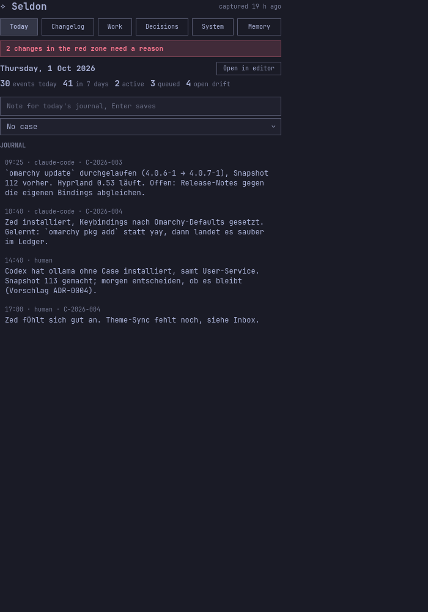
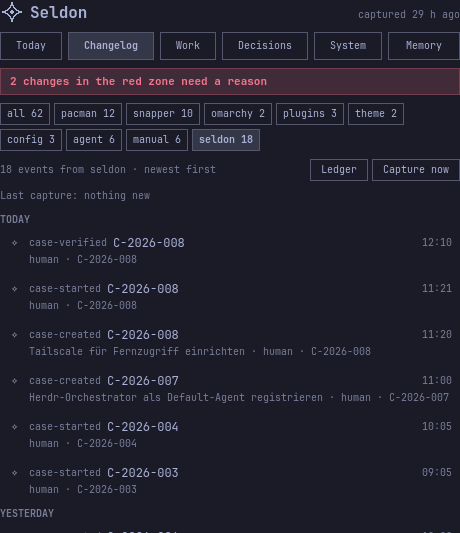
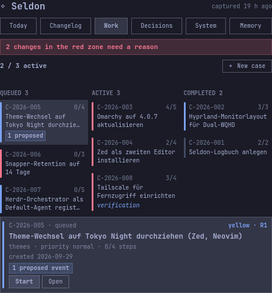
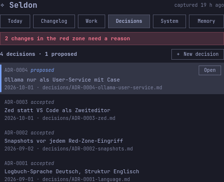
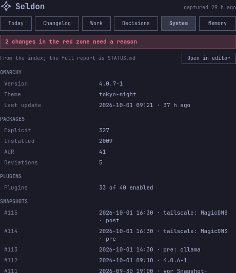
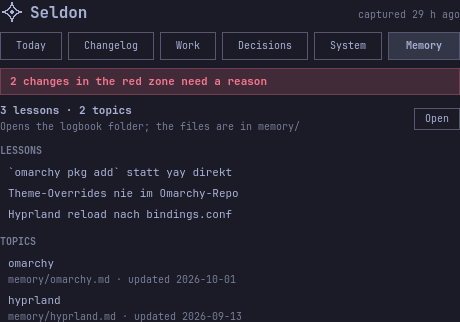
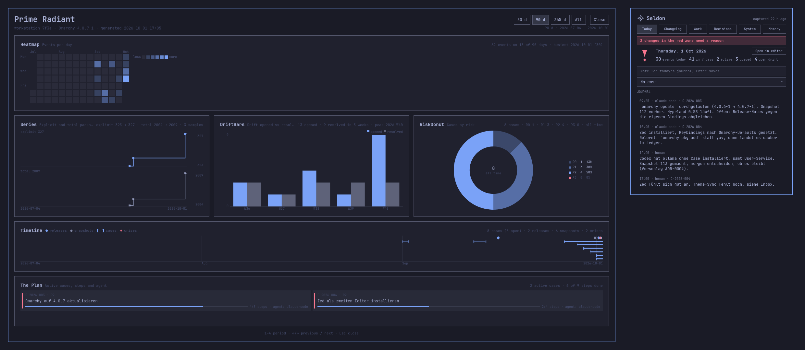

# Alltag

<!-- source: en/03-daily-use.md @ d6953a36 -->

Diese Seite behandelt die Teile von Seldon, die du jeden Tag siehst: die
Pill in der Bar, das Panel mit seinen sechs Tabs, die Tasten und das
Overlay Prime Radiant mit seinen Zeiträumen. Alles hier geht mit der Maus
und mit der Tastatur. Die Beschriftungen der Oberfläche sind in dieser
Version englisch; diese Seite nennt sie so, wie du sie siehst.

## Ein Tag mit Seldon

- Morgens ein Blick auf die Pill. Das Zeichen, dann `2 · 1`, heißt: zwei
  aktive Cases und eine Krise. Ohne Krise fällt die zweite Zahl weg.
- Vor einer Änderung legst du einen Case an (`+` im Panel) und startest
  ihn.
- Während der Arbeit schreibst du eine Notiz, wenn du etwas lernst (`n`
  im Panel).
- Nimmt die Pill die Fehlerfarbe deines Themes an, öffnest du das Panel
  und liest die rote Zeile. Nur darauf sollst du schauen. Andere
  Änderungen ohne Case warten leise im Changelog; lös sie auf, wann du
  willst, oder lass es einen Agenten tun.
- Am Ende eines Case prüfst du ihn und schließt ihn im Tab Work ab.
- Einmal pro Woche öffnest du den Prime Radiant und schaust dir das Bild
  an.

## Die Pill

Die Pill sitzt rechts in der Bar.

- Das Seldon-Zeichen, dann `A · D`: A ist die Zahl der aktiven Cases, D
  die Zahl der Krisen. Teile, die null sind, fallen weg: das Zeichen
  allein, `2`, `· 1`. Das Zeichen nimmt die Farbe der Pill. Änderungen
  ohne Case, die keine Krise sind, zählt sie nicht: Der Tab Today des
  Panels und der Tooltip zählen sie (*without a case*). Die Einstellung
  `driftInBar` auf `all` zählt sie auch in der Bar (siehe
  [Konfiguration](06-configuration.md#einstellungen-des-plugins)).
- Sie nimmt die Akzentfarbe deines Themes, solange Cases aktiv sind, die
  Warnfarbe des Themes bei einer Krise und wird blasser, solange etwas
  repariert werden muss.
- Der Tooltip sagt, was die Zahlen bedeuten, wie viele Änderungen keinen
  Case haben und wann die Engine zuletzt erfasst hat: „Seldon — 2 active
  cases, 1 crisis, 7 changes without a case, last capture 4 min ago“.

| Klick | Wirkung |
|---|---|
| Links | Panel öffnen oder schließen |
| Mitte | Prime Radiant öffnen oder schließen |
| Rechts | jetzt erfassen (`seldon capture`, dann `seldon status`) |

## Das Panel

Das Panel öffnet sich unter der Pill. Es hat sechs Tabs, jeder mit einer
festen Zifferntaste. Über jedem Tab kann ein Banner stehen (etwas muss
repariert werden, siehe
[Fehlersuche](10-troubleshooting.md#banner-im-panel)) und, nur solange
es eine Krise gibt, eine rote Zeile „N changes that can affect boot,
login or the shell have no case“. Ein Klick auf die rote Zeile zeigt die
erste.

Die Bilder auf dieser Seite sind Renderings des Beispiel-Logbuchs im
Theme Tokyo Night. Dein Panel nimmt dein Theme und zeigt deine Daten.

### Today (1)



*Beispieldaten.*

Today zeigt das Datum und die Zahlen des Tages: Ereignisse heute und in
sieben Tagen, aktive und geplante Cases, Änderungen ohne Case. Darunter liegt das
Notizfeld: Notiz tippen, Enter drücken, und sie landet über `seldon log`
im heutigen Journal. Wähl unter dem Feld einen offenen Case, um die
Notiz unter ihm abzulegen. Das Feld leert sich erst, wenn die Notiz
gespeichert ist. Danach folgen die heutigen Journal-Einträge; die von
gestern liegen hinter einer Zeile. *Open in editor* öffnet die heutige
Journal-Datei.

### Changelog (2)



*Beispieldaten, gefiltert auf die Quelle `seldon`.*

Der Changelog listet jedes Ereignis, das neueste zuerst, nach Tagen
gruppiert. Die Chips oben filtern nach Quelle; jeder zeigt seine Zahl.
Snapshot-Zeilen sind hervorgehoben. Eine leise Zeile unter dem Kopf sagt
„N changes without a case“. Ihre Zeilen lauten „No case“, eine Krise
„Crisis · no case“ in der Warnfarbe deines Themes; beide tragen einen
Knopf *Resolve…*. Routine-Änderungen (ein Theme-Wechsel, ein Schalter,
ein einfaches Upgrade) sind gewöhnliche Zeilen: Geschichte, nichts
aufzulösen.

*Capture now* startet eine Erfassung; die Zeile darunter sagt, was sie
gefunden hat. *Ledger* öffnet die Ledger-Ansicht des Monats in deinem
Editor.

Um Drift aufzulösen, drück Enter auf einer Drift-Zeile, klick
*Resolve…* oder klick auf die rote Zeile. Du darfst; du musst nie. Der
Drift-Dialog zeigt, was
sich geändert hat, wer es war, wann, die Zone, den vorgeschlagenen Case
und jedes Paket einer Transaktion. Wähl eine Aktion:

| Aktion | Führt aus | Die Zeile sagt danach |
|---|---|---|
| *Link* | `seldon drift link <EVENT> <CASE>` (offene Cases; der vorgeschlagene ist vorgewählt) | `linked to C-…` |
| *Explain* | `seldon drift explain <EVENT> -- <warum>`, wahlweise mit Zone, Risiko und Bereich | `explained · C-…` |
| *Dismiss* | `seldon drift dismiss <EVENT> -- <grund>` | `dismissed: <grund>` |

Eine Paket-Transaktion löst du als Ganzes auf (*All N*). *Only
<Paket>* löst nur die Zeile auf, die du geöffnet hast. Dein Text bleibt
im Dialog, bis die Engine ihn geschrieben hat. Hat inzwischen jemand
anderes die Änderung aufgelöst, sagt der Dialog „Already resolved: …“ und
schreibt nichts.

### Work (3)



*Beispieldaten.*

Das Feld oben startet einen Case mit einem Satz: Schreib, was erledigt
werden soll („Installiere Tool X, es bringt ein PKGBUILD mit“), und drück
Enter oder *Run*. Seldon macht aus dem Satz einen Case, startet ihn und
startet deinen Agenten darauf; der Agent macht den Rest und schließt den
Case selbst ab (siehe
[Mit Agenten arbeiten](04-working-with-agents.md#einen-agenten-aus-dem-panel-starten)).
Solange das läuft, steht auf dem Knopf *Running*, danach steht der Cursor
auf dem neuen Case. Kann kein Agent starten, sagt die Zeile unter dem
Feld, warum und wie du es behebst, und dein Satz bleibt im Feld.

Work zeigt deine Cases in drei Spalten: Queued (geplant), Active (Cases
in Prüfung eingeschlossen) und Completed (die letzten 50; aufgegebene
Cases durchgestrichen). „2 / 3 active“ vergleicht deine aktiven Cases mit
deinem Limit. Das Limit warnt; es blockiert nie. Eine Kachel zeigt die
ID, erledigte von allen Schritten, den Titel und die Zone als Farbe des
Streifens. „N proposed“ heißt, Seldon hält offene Drift für einen Teil
dieses Case. „by agent“ markiert einen Case, den ein Agent abgeschlossen
hat; *By agent* zeigt unter Completed nur diese, für eine Stichprobe,
wenn dir danach ist (fällig ist sie nie).

Die Karte darunter zeigt den Case unter dem Cursor und die Aktionen, die
sein Status erlaubt:

| Status | Aktionen |
|---|---|
| queued | *Start*, *Open* |
| active | *Verify*, *Start agent*, *Drop*, *Open* |
| verification | *Done*, *Drop*, *Open* |
| completed | *Open*, *Reopen* |
| dropped | *Open* |

*Reopen* (ein Klick oder `r`) lässt den abgeschlossenen Case unberührt:
Es legt einen neuen aktiven Case „Reopen: <Titel>“ mit demselben
*Intent* an, und der Cursor springt dorthin. Seine Karte nennt den Case,
den er wieder öffnet. Ist ein anderer offener Case der aktive Case,
bleibt er es, damit ein Agent, der daran arbeitet, weiter dort
aufgezeichnet wird; die Zeile unter dem Feld sagt das.

*New case* (oder `+` aus jedem Tab) fragt nach Titel, Zone, Risiko,
Priorität und einem optionalen Bereich. Es beginnt mit gelb, R1, normal.
Nimm es, wenn du einen Case selbst planen oder später einem Agenten
übergeben willst. *Start agent* schickt einen Agenten an den Case; siehe
[Mit Agenten arbeiten](04-working-with-agents.md#einen-agenten-aus-dem-panel-starten).

### Decisions (4)



*Beispieldaten.*

Decisions listet deine ADRs, das neueste zuerst: ID, Status (*proposed*
ist markiert, *superseded* durchgestrichen), Titel und Datum. *Open*
öffnet eine Entscheidung in deinem Editor. *New decision* (oder `d`)
fragt nach einem Titel, legt die Entscheidung als *proposed* an und
öffnet sie.

### System (5)



*Beispieldaten.*

System zeigt die Maschine: Omarchy-Version, Theme und letztes Update,
Paketzahlen, Abweichungen, Plugins, Snapshots, Bereiche, den Zustand
jedes Collectors, den Namen der Maschine und die Version der Engine, die
unter `~/.config` bearbeiteten Dateien, die kein beobachteter Pfad
abdeckt, und *Ignored by pacman*: die Pakete und Gruppen, die pacmans
volles Update auslässt (`IgnorePkg`, `IgnoreGroup`; `pacman -S`
aktualisiert sie trotzdem). *Open in editor* öffnet `STATUS.md`.

### Memory (6)



*Beispieldaten.*

Memory zeigt, was deine Agenten zu Beginn einer Sitzung lesen: die
Überschriften von `memory/lessons.md` und die anderen Memory-Dateien mit
ihrer letzten Änderung. *Open* öffnet den Ordner des Logbuchs.

## Tasten

Die Tasten des Panels gelten, solange das Panel offen ist.

| Taste | Wirkung |
|---|---|
| `1` bis `6` | ein Tab über seine Nummer: Today 1, Changelog 2, Work 3, Decisions 4, System 5, Memory 6 |
| ← / →, `h` / `l` | vorheriger / nächster Tab |
| ↑ / ↓, `k` / `j` | in der Liste bewegen; in Work spaltenweise durch die Cases |
| Tab / Shift-Tab | das nächste / vorherige Panel der Bar, wie in jedem Omarchy-Panel |
| Enter, Leertaste | die Zeile öffnen; auf einer Drift-Zeile den Drift-Dialog; in Work die erste Aktion der Karte |
| `x` | Work: den Case unter dem Cursor aufgeben (zweimal drücken) |
| `a` | Work: einen Agenten auf den aktiven Case unter dem Cursor starten (zweimal drücken) |
| `r` | Work: den abgeschlossenen Case unter dem Cursor wieder öffnen |
| `i` | Work: das Feld für den einen Satz (Enter startet, Esc gibt die Tasten zurück) |
| `f` / `F` | Changelog: nächster / vorheriger Quellen-Filter |
| `c` | jetzt erfassen |
| `n` | eine Notiz schreiben (aus jedem Tab) |
| `+` | neuer Case (aus jedem Tab) |
| `d` | Decisions: neue Entscheidung |
| `e` | die Datei dieses Tabs im Editor öffnen |
| Esc | schließen |

Aktionen, die schreiben, brauchen auf der Tastatur zwei Tastendrücke:
*Start*, *Verify*, *Done*, *Drop* (`x`), *Start agent* (`a`), das
Drift-Dialog und eine neue Entscheidung. Das erste Enter schaltet die
Aktion scharf, und die Karte sagt „Press Enter again: Start C-2026-005“. Der
zweite Druck sendet sie. Jede andere Taste in einer Liste entschärft sie.
Eine gehaltene Taste zählt als ein Druck: Sie bestätigt nie und sendet nie
zweimal; nur die Tasten, die die Auswahl bewegen, wiederholen sich.
Eine Notiz und ein neuer Case gehen mit einem Enter raus, ein Satz für
*Run* auch. *Reopen* braucht einen Druck oder Klick: Es fügt nur einen
Case hinzu. Mit der Maus sendet ein Klick, außer bei *Drop* und *Start
agent*, die einen zweiten Klick verlangen.

Hat ein Textfeld oder ein Dialog den Fokus, geht jede Taste dorthin. Tab
und Shift-Tab wandern durch die Felder. Esc gibt die Tasten ans Panel
zurück und behält, was du getippt hast.

## Der Prime Radiant



*Renderings des Beispiel-Logbuchs, Tokyo Night. Links der Prime Radiant, rechts das Panel.*

Der Prime Radiant ist ein bildschirmfüllendes Overlay mit dem Bild deiner
Maschine. Du öffnest ihn mit einem Mittelklick auf die Pill oder mit
`omarchy-shell shell toggle jax.seldon`. Für eine Taste fügst du diese
Zeile zu deinen Hyprland-Bindings hinzu (Seldon richtet sie nie für dich
ein):

```text
o.bind("SUPER + SHIFT + S", "Seldon", "omarchy-shell shell toggle jax.seldon")
```

Er zeigt sechs Diagramme:

| Diagramm | Zeigt |
|---|---|
| Heatmap | Ereignisse pro Tag als Kalender, Wochen als Spalten, Montag oben |
| Series | explizite und gesamte Paketzahl über die Zeit |
| DriftBars | geöffnete und aufgelöste Drift pro Woche |
| RiskDonut | Cases nach Risiko, R0 bis R3, immer über die ganze Zeit |
| Timeline | Omarchy-Releases, Snapshots und Krisen oben, Cases als Spannen darunter |
| The Plan | die aktiven Cases mit Zone, Risiko, Schritten und Agent |

Die Titelzeile jedes Diagramms trägt eine Zusammenfassung. Zeigst du auf
ein Diagramm, nennt die Titelzeile stattdessen das Element unter dem
Zeiger: einen Tag und seine Ereignisse nach Quelle, die Zahlen einer
Woche, einen Case.

### Zeiträume

Die Zeitraum-Auswahl oben bestimmt das Fenster: 30 Tage, 90 Tage, 365
Tage oder All. Es reicht bis heute; 30 d sind heute und die 29 Tage
davor. Der Prime Radiant öffnet jedes Mal mit 90 d. RiskDonut und The
Plan beachten den Zeitraum nicht.

| Taste | Wirkung |
|---|---|
| `1` `2` `3` `4` | 30 d, 90 d, 365 d, All |
| ← / →, `h` / `l` | vorheriger / nächster Zeitraum |
| Esc | schließen |

Ein Klick auf die abgedunkelte Fläche oder auf *Close* schließt ihn auch.
Der Prime Radiant zeigt nur; er startet nie die Engine.

## Der Graph

Ab 0.2.0 zeichnet Abschnitt 8 des Desks das Gedächtnis deiner Maschine
als Netz: Bereiche, Cases, Entscheidungen und Änderungen, verbunden so,
wie das Logbuch sie verbindet. Eine Änderung hängt an ihrem Case, ein
Case an seinem Bereich, eine Entscheidung an den Cases, die sie nennt.
Eine gestrichelte Linie führt von einer Änderung zu dem Case, den Seldon
für sie vorschlägt. Krisen sind rot. *Play growth* spielt das Netz vom
ersten Tag an ab; der Schieberegler wählt einen Tag.

| Tun | Wie |
|---|---|
| einen Knoten bewegen | ziehen |
| die Ansicht verschieben | den Hintergrund ziehen |
| zoomen | das Mausrad, `-` und `=`; `0` passt die Ansicht ein |
| die Karte eines Knotens sehen | darauf zeigen; ein Klick hält die Karte |
| einen Case öffnen | *Open case* auf seiner Karte: Work zeigt ihn |
| abspielen | *Play growth*, Leertaste oder `p`; ← und → gehen einen Tag |
| Esc | das Abspielen anhalten, eine gehaltene Karte loslassen, dann schließen |

Der Graph entsteht aus dem Index und enthält deshalb, was der Index
enthält: die neuesten 500 Ereignisse und 50 abgeschlossenen Cases. Die
Fußzeile nennt die Zahlen. Über 400 Knoten werden die Änderungen eines
Tages und einer Quelle zu einem Knoten („+12“); seine Karte zählt sie
auf. Das Layout bewegt sich nur, solange der Abschnitt zu sehen ist, und
hält nach wenigen Sekunden an.

## Vom Terminal aus

Für alles im Panel gibt es einen Befehl. Das Panel führt dieselben
Befehle aus, das Ergebnis ist also dasselbe:

| Im Panel | Im Terminal |
|---|---|
| Notizfeld | `seldon log -- "Text"` |
| *Capture now* | `seldon capture` |
| *Run* | `seldon agent start --new -- "Was zu tun ist"` |
| *New case* | `seldon plan new -- "Titel"` |
| *Start*, *Verify*, *Done*, *Drop* | `seldon plan start <ID>` und so weiter |
| *Reopen* | `seldon plan reopen <ID>` |
| *Update rules* | `seldon rules update` |
| Drift-Dialog | `seldon drift link`, `explain`, `dismiss` |
| *New decision* | `seldon decide -- "Titel"` |
| *Open in editor* | `seldon open journal --editor` |

Die [Befehlsreferenz](05-cli-reference.md) listet jeden Befehl.

---

Zurück: [Konzepte](02-concepts.md) · [Übersicht](README.md) · Weiter: [Mit Agenten arbeiten](04-working-with-agents.md)
